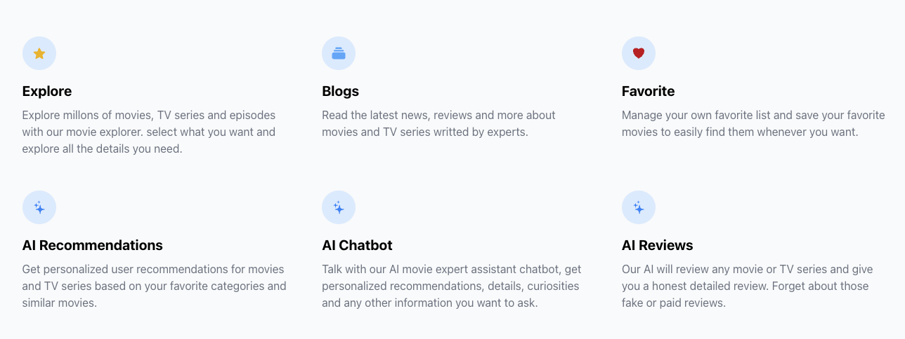

<div align="center">
  <h3 align="center"> <b>Movie AI Explorer - Frontend</b> </h3>
  <h3 align="center">Movie Explorer with AI Enhancements</h3> 
</div>

# Features 🌟



# Technologies ⚙️

Core technologies used..

- [Next.js 15](https://nextjs.org) & [React 19](https://react.dev)
- [Fetch API](https://developer.mozilla.org/en-US/docs/Web/API/Fetch_API) for the requests
- [TailwindCSS](https://tailwindcss.com) for styles 
- [Zod](https://zod.dev) for robust type validation
- [Jose](https://www.npmjs.com/package/jose) for encryption, decryption, jwt and cookies

# Project Structure 📐

The project structure is based on the new [Next App Router](https://nextjs.org/docs/app/getting-started/project-structure#store-project-files-outside-of-app) folder structure. This strategy stores all application code in shared folders in the root of the project and keeps the `/app` directory purely for routing purposes.

Most relevant files and directories are:

```v
   ├── app                             # App router
      ├── api                          # App route handler
      └── auth                         # /auth route
         ├── login                     # /auth/login page
         ├── register                  # /auth/register page
         └── layout.tsx                # Auth layout
      └── home                         # /home route
         └── example                   # Example module (all follows the same)
            └── [id]                   # /example/:id page
            └── ui                     # Specific UI components for this route
            └── page.ts                # /example page
      ├── layout.tsx
      └── page.tsx
   └── components                      # Reusable components
      ├── (...rest)
      ├── icons                        # Components icons
      ├── layouts                      # Grids and layouts
      └── ui                           # Small html tags
   ├── hooks                           # Custom and reusable hooks
   ├── interfaces                      # Interfaces
   └── lib                             # Helper functions
      ├── actions                      # All app server actions
      ├── queries                      # All app fetch (GET)
      └── (...rest)
   ├── .env                            # Enviroments variables for local
   ├── next.config.js                  # Next.js configuration file
   ├── package.json                    # Node.js dependencies
   ├── README.md                       # Project documentation
   └── tailwind.config.ts              # Tailwind config
```

# Deploy 🚀

### Git flow

Push to **main** branch deploy to `PROD` via AWS Amplify

- Deploy to [PROD]

# Getting started 💥

How to install and running the app.

- Clone this repo by running:

```bash
   git clone https://github.com/jgtavarez/movie-ai-explorer-frontend.git

   # or via SSH

   git clone git@github.com:jgtavarez/movie-ai-explorer-frontend.git
```

- Move to develop branch:

```bash
   git checkout develop
```

- Install dependencies:

```bash
  npm install
```

- Create .env file

```bash
   cp .env.template .env
   # then set your env values
   # Tip: You can run `openssl rand -base64 32` to generate a secure value for AUTH_SECRET
```

- Start development mode

```bash
  npm run dev
```

> Navigate to `http://localhost:3000`

# Development Pattern 📝

### Application Architecture

This application leverages the [Server and Client Composition Patterns](https://nextjs.org/docs/app/building-your-application/rendering/composition-patterns) recommended by Next.js to prioritize server-side rendering while minimizing client-side usage for optimal performance and maintainability. The main architectural strategies include:

- **Server and Client Composition**:  
  The application is designed with a "server-first" approach, where most components and pages are rendered on the server. Client-side rendering is only used for specific sections that require it (e.g., hooks, effects, or interactivity).

  - Large pages or components are composed of smaller, server-rendered parts. When client-side functionality is required, only the specific section is moved to the client, avoiding unnecessary client-side rendering for the entire page. This keeps the application efficient and aligns with Next.js best practices.

- **File-Based Routing**:  
  The application follows the [Routing Files pattern](https://nextjs.org/docs/app/getting-started/project-structure#routing-files), organizing related pages into groups and implementing dedicated files for key states:

  - **`layout.tsx`**: Used to define a layout in your Next.js application.
  - **`page.tsx`**: The page file allows you to define UI that is unique to a route.
  - **`loading.tsx`**: Displays a loading state while data or the page is being fetched or generated.
  - **`notfound.tsx`**: Handles 404 errors gracefully for pages not found.
  - **`error.tsx`**: Manages unexpected errors within specific routes.
  - **`route.ts`**: Allow to create custom request handlers for a given route using the Web Request and Response APIs.

- **Data Sharing Between Components**:  
  Im not a big fan on `useContext` or other client-side state management tools in server-first applications even Next [dont recommend it](https://nextjs.org/docs/app/building-your-application/rendering/composition-patterns#sharing-data-between-components), the application takes advantage of [fetch](https://nextjs.org/docs/app/api-reference/functions/fetch) and caching. Data fetched for a page is shared seamlessly across components without duplicating requests. This approach avoids the need to move components to the client unnecessarily using.
  By reusing cached data, the application improves performance and reduces the overhead of additional client-side state management useContext, useReducer, useState, useEffect.

- **Server Actions**:

The application employs [server actions](https://nextjs.org/docs/app/building-your-application/data-fetching/server-actions-and-mutations) for handling mutation requests. These actions encapsulate business logic and are invoked:
Directly in server-side components making it asynchronous and in event handlers in client-side components, enabling  integration of server-side functionality with client-side interactivity when necessary.

- **Static Generation**:

Blog pages are created in the build time using [Incremental Static Regeneration (ISR)](https://nextjs.org/docs/app/building-your-application/data-fetching/incremental-static-regeneration)

---

This architecture ensures that the application remains fast, scalable, and maintainable, fully embracing the modern capabilities of Next.js to optimize rendering strategies and data management. This is just related to Next but specific to React there are small HOC components, use of Hooks Pattern and Container/Presentational Pattern, lazy loading and portals.

# Other Useful Commands 💥

How to install and running the app.

- Build production `/.next`:

```bash
   npm run build
```

- Start production mode:

```bash
   npm run start
```

- Unit tests:

```bash
  yarn run test
```